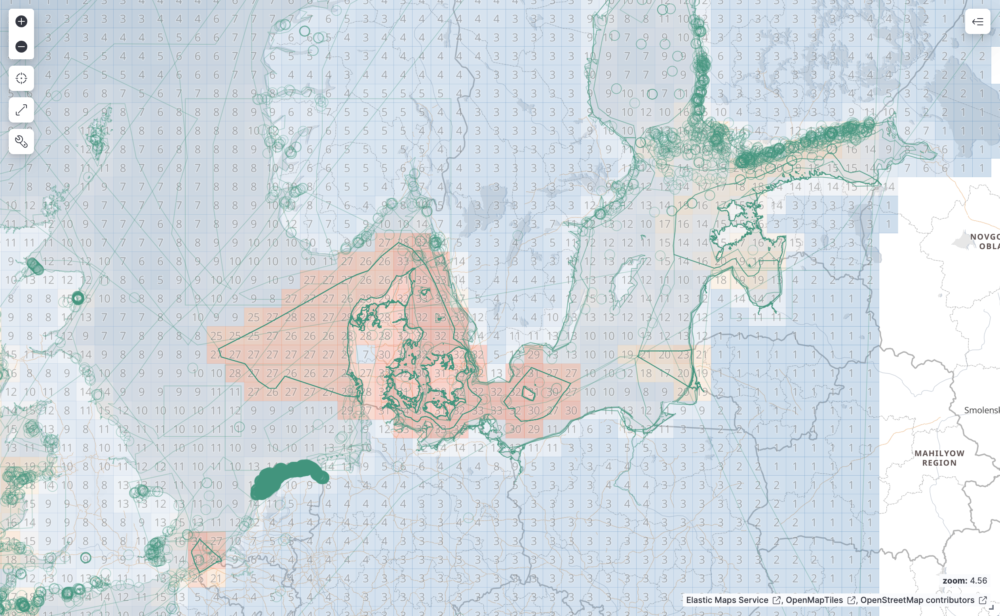

# Portal architecture

## Functional requirements

The goal of the BioEco portal is to:

- show the spatial coverage of monitoring programmes by EOV, subvariables, SOPs
- provide access to monitoring programme metadata (EOV, subvariables, spatial and temporal coverage, SOPs, readiness levels)
- show the spatial coverage of EOV datasets or products by EOV or monitoring programme
- act as a data discovery service for OBIS

## Data flow

The data flow into the portal is expected to go through the ODIS architecture, i.e. by publishing schema.org metadata online and registering the source in the ODIS catalog. To avoid having to set up harvesting infrastructure, we can try working with the OceanInfohub knowledge graph, but as this is currently not kept up to date, alternatives need to be explored. A first version of the portal can make use of a static graph export from the current GeoNode based system (see https://github.com/iobis/bioeco-export). If necessary we can split up this graph by programme to make updates easier.

## Tech stack

To be able to query and process the harvested linked data, it first needs to be loaded into a graph database. During prototyping, we converted the JSON-LD graph to Turtle (`prototyping/bioeco_convert_ttl.py`) before importing into Blazegraph (`prototyping/load_blazegraph.sh`). From the graph database we can extract the entities we are interested in and load them into Elasticsearch.

From Elasticsearch we can serve vector tiles for the programme geometries, or for a gridded aggregation with programme counts. As grid aggregation is currently not freely available for `geo_shape` fields, we will need a separate index where programme geometries have been converted to `geo_point` collections.

The API also needs to support spatial searches, so the user can click a grid cell and list the relevant programmes.

### API

Endpoints and parameters:

- `eov`
- `subvariable`
- `sop`
- `/programme`
  - `eov`
  - `subvariable`
  - `sop`
  - `search`
  - `start_year`
  - `end_year`
  - `bbox`
- `/programme/{id}`
- `/dataset`
  - `eov`
  - `subvariable`
  - `sop`
  - `programme`
  - `start_year`
  - `end_year`
  - `bbox`
- `/dataset/{id}`
- `/tiles/programme/{z}/{x}/{y}.mvt`
  - `eov`
  - `subvariable`
  - `sop`
  - `search`
  - `start_year`
  - `end_year`
- `/tiles/dataset/{z}/{x}/{y}.mvt`
  - `eov`
  - `subvariable`
  - `sop`
  - `programme`
  - `start_year`
  - `end_year`

### Frontend

The new frontend will be based on the existing React app. Functionality for viewing data coverage needs to be added.
